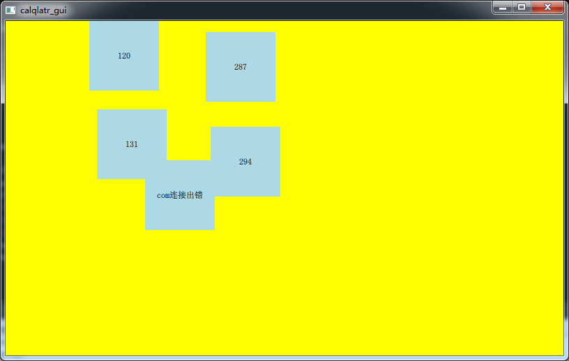

# scada-组态软件
#### 1.文件说明
Mitsubishi_server--模拟三菱设备
Modbus--modbus驱动
com_net--数据采集
gui_net--图形界面
modbus_server--模拟modbus设备
tcp508neth--tcp-508n以太网驱动
tcp508nserial--tcp-508n串口驱动
tests--配置文件

#### 2.使用说明
##### 1.下载qt-opensource-windows-x86-5.12.10
##### 2.查看本地ip地址，修改com_net文件夹下dev_factor.cpp中两处ip为本机ip。

##### 3.查看本地ip地址，修改gui_net文件夹下dev_driver.cpp中一处ip为本机ip。

##### 4.运行Modbus生成Modbus.dll，将Modbus.dll复制一份并改名为Mitsubishi.dll，运行com_net，
##### 将Modbus.dll和Mitsubishi.dll两个文件拷贝到build-com_net-Desktop_Qt_5_12_10_MinGW_32_bit-Debug\debug。
##### 5.依次运行modbus_server和Mitsubishi_server。然后运行com_net，最后运行gui_net。gui_net正常显示入下图所示
